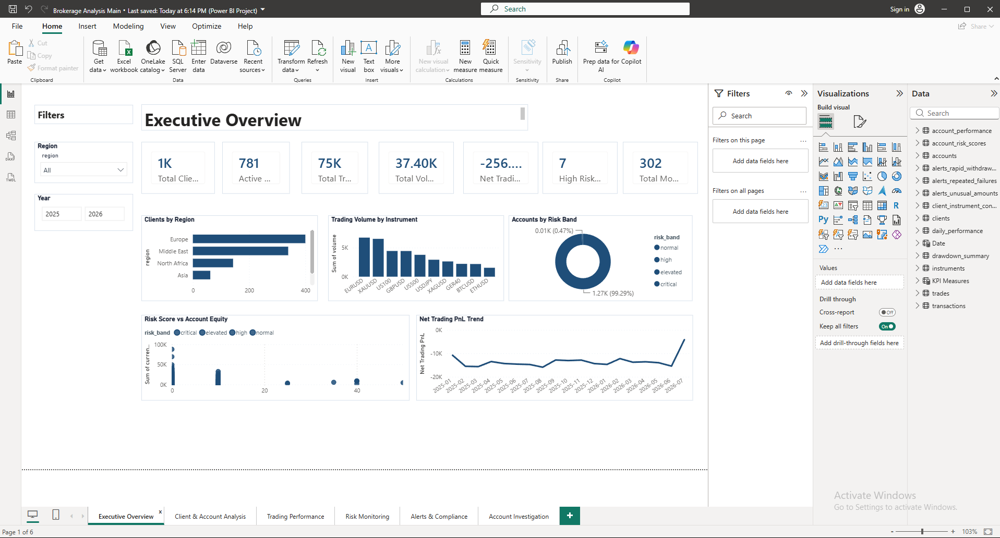
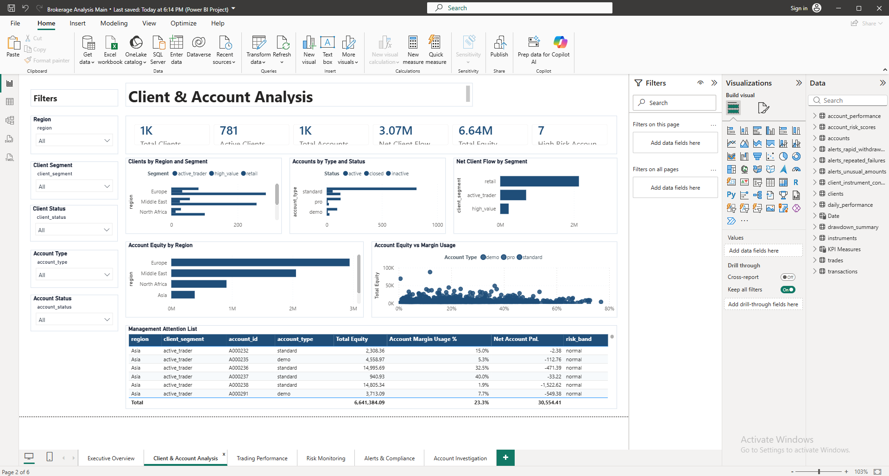
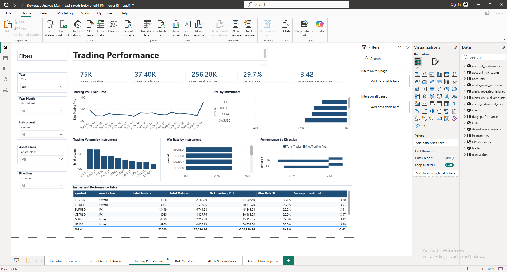
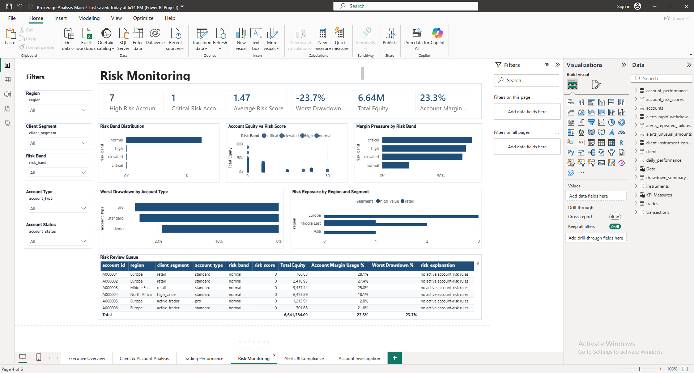
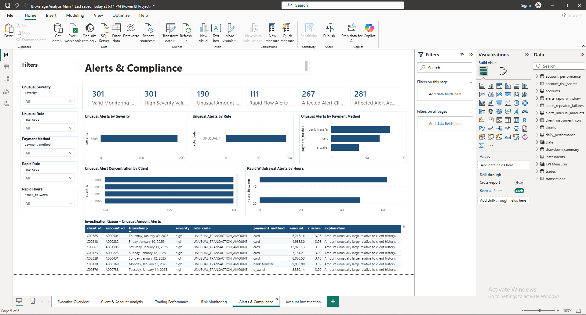
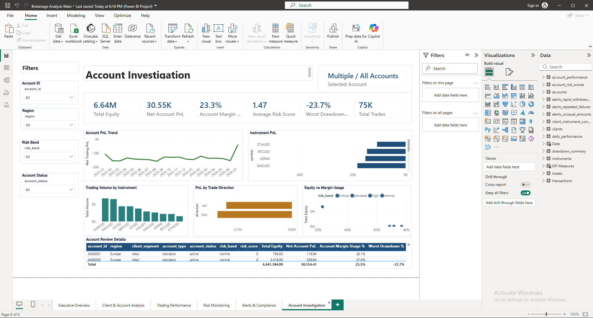
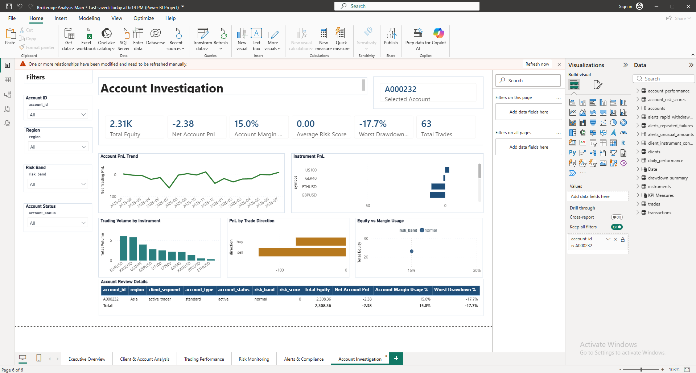
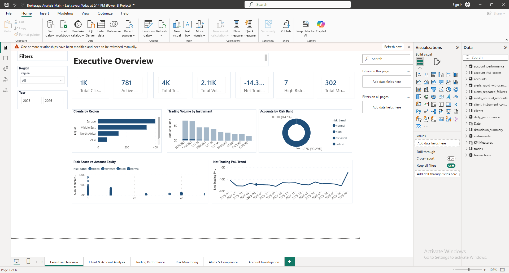

# Brokerage Analytics & Risk Monitoring Platform

A six-page Power BI portfolio project focused on brokerage analytics, trading performance, account risk monitoring, compliance alert review, and account-level investigation.

**Sole Author, Designer & Developer: Faisal Fakhouri**

> Portfolio project. The data and scenarios represented in this repository are intended for demonstration and analytical purposes.

## Project Overview

Brokerage operations generate large volumes of client, account, trade, performance, risk, and monitoring-alert data. This project brings those areas together into a structured Power BI analytical workflow designed to help a user move from a high-level business view to detailed account investigation.

The report contains six analytical pages:

1. **Executive Overview** — headline KPIs, client distribution, trading volume, risk distribution, equity/risk relationships, and trading PnL trend.
2. **Client & Account Analysis** — segmentation, account type and status analysis, net client flow, regional equity, margin usage, and a management attention list.
3. **Trading Performance** — trade count, volume, PnL, win rate, average trade PnL, instrument analysis, directional performance, and an instrument performance table.
4. **Risk Monitoring** — high-risk and critical-risk account monitoring, average risk score, drawdown, margin pressure, regional risk exposure, and a risk review queue.
5. **Alerts & Compliance** — monitoring alert volume, severity, rule analysis, payment method analysis, client concentration, rapid-withdrawal timing, and an investigation queue.
6. **Account Investigation** — an account-level drill-through destination with selected-account context, account KPIs, PnL trend, instrument PnL, trading volume, directional PnL, equity versus margin usage, and detailed account review information.

## Core Analytical Workflow

Users can identify an account in the **Management Attention List** or **Risk Review Queue**, then drill through to the **Account Investigation** page. The destination page receives the selected `account_id` context and updates its connected KPIs and visuals.

**Monitor → Identify → Investigate → Review**

This turns the project from a collection of static dashboard pages into a practical analytical workflow.

## Technical Highlights

- Power BI Project (`.pbip`) structure suitable for source control
- Separate report and semantic-model project definitions
- DAX measures for client, account, trading, risk, and monitoring KPIs
- Interactive slicers and cross-filtering
- Account-level drill-through using `accounts[account_id]`
- Selected-account context display
- Six-page analytical report architecture
- Git-based version history and iterative development

## Dashboard Showcase

### 1. Executive Overview

A high-level view of brokerage activity, combining core business KPIs, client distribution, instrument activity, risk segmentation, equity-versus-risk analysis, and trading PnL trends.



### 2. Client & Account Analysis

Analyzes client segmentation, account composition, net client flow, regional equity, margin usage, and accounts requiring management attention.



### 3. Trading Performance

Provides detailed analysis of trading activity and profitability through trade volume, net PnL, win rate, average trade PnL, instrument-level performance, directional comparison, and performance trends.



### 4. Risk Monitoring

Focuses on account risk through risk-band distribution, risk scores, margin pressure, drawdown, regional exposure, and a detailed Risk Review Queue.



### 5. Alerts & Compliance

Examines monitoring alerts by severity, rule category, payment method, client concentration, and rapid-withdrawal timing, supported by a detailed investigation queue.



### 6. Account Investigation

The investigation page provides focused account-level analysis across equity, account PnL, margin usage, risk score, drawdown, trading activity, instrument concentration, and directional profitability.



### Drill-through Investigation Workflow

Accounts identified in the Management Attention List or Risk Review Queue can be opened through Power BI drill-through. The Account Investigation page receives the selected `account_id` context and recalculates connected KPIs and visuals for that account.



The detailed investigation view supports deeper review of account activity, performance, risk characteristics, and trading behavior.



---
## Business Questions Addressed

- Where are clients and accounts concentrated?
- Which instruments generate the most trading activity?
- How does trading PnL change over time?
- Which accounts show elevated risk, margin pressure, or drawdown?
- Which accounts require management attention?
- Where are monitoring alerts concentrated?
- How do profitability, trading activity, and risk characteristics change when investigating one account?

## Repository Structure

```text
.
├── Brokerage Analysis Main.pbip
├── Brokerage Analysis Main.Report/
├── Brokerage Analysis Main.SemanticModel/
├── README.md
├── PROJECT_CASE_STUDY.md
├── TECHNICAL_OVERVIEW.md
├── INTERVIEW_GUIDE.md
├── CV_AND_LINKEDIN.md
└── COPYRIGHT_AND_USAGE.md
```

## How to Open the Project

1. Clone or download this repository.
2. Open `Brokerage Analysis Main.pbip` in a compatible version of Power BI Desktop.
3. If Power BI requests a local model refresh, refresh the model.
4. Explore the six report pages.
5. To test the workflow, right-click an account row in the Management Attention List or Risk Review Queue and drill through to **Account Investigation**.

## Skills Demonstrated

Power BI · DAX · Data Modeling · Business Intelligence · Financial Analytics · Risk Analytics · Dashboard Design · Drill-through Workflows · Data Visualization · Git · GitHub

## Author

**Faisal Fakhouri**  
Faisal Fakhouri is the sole author, designer, and developer of the Brokerage Analytics & Risk Monitoring Platform.

See `COPYRIGHT_AND_USAGE.md` for attribution and usage information.
